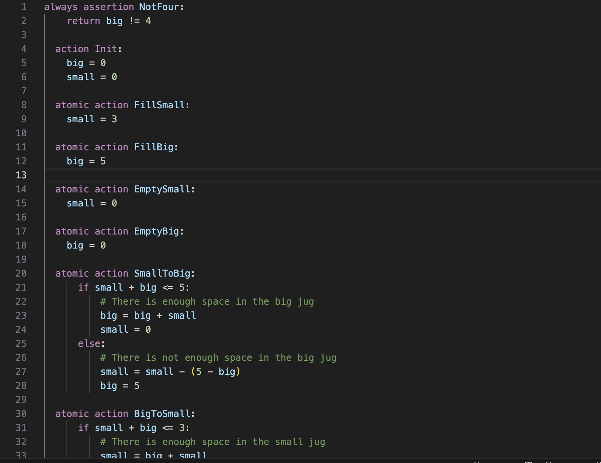
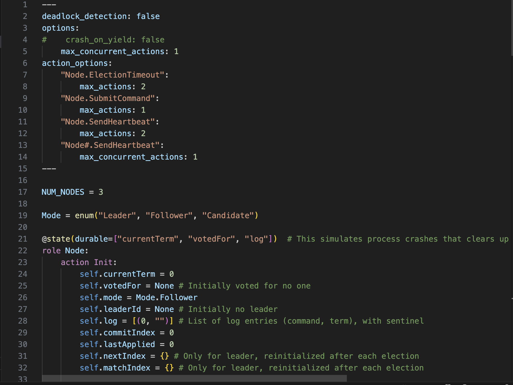

# Fizzbee Language Support for VS Code

This extension provides syntax highlighting and language support for the [Fizzbee model checking system](https://fizzbee.io/).

## Features

- Syntax highlighting for Fizzbee keywords, operators, and constructs
- Code snippets for common Fizzbee patterns
- Auto-indentation and bracket matching
- Comment toggling support

## Supported File Extensions

- `.fizz`

## Language Features

### Keywords
- Control flow: `if`, `elif`, `else`, `for`, `while`, `break`, `continue`, `return`, `pass`
- Actions: `action`, `Init`
- Block modifiers: `atomic`, `serial`, `parallel`, `oneof`
- Quantifiers: `any`, `all`
- Assertions: `always`, `eventually`, `assertion`
- Fairness: `fair`, `weak`, `strong`
- Guards: `require`

### Snippets
The extension includes snippets for common Fizzbee constructs:
- `action` - Create a new action
- `atomic action` - Create an atomic action
- `fair action` - Create a fair action
- `init` - Create Init action
- `always` - Create an always assertion
- `eventually` - Create an eventually assertion
- And more...

### Example Syntax Highlighting

Here are two examples of Fizzbee code rendered with this extension in VS Code:

  
*Fizzbee model of the classic Die Hard problem*

  
*Fizzbee model of the Raft consensus algorithm*

## Installation

1. Open Visual Studio Code.
2. Go to the **Extensions** view by clicking the square icon in the left side of the window.
3. In the search bar, type **Fizzbee**.
4. Click **Install** on the extension.
5. Open any `.fizz` file to see syntax highlighting.
## Contributing

Contributions are welcome! Please submit issues and pull requests on GitHub.

## License

This extension is licensed under the MIT License.